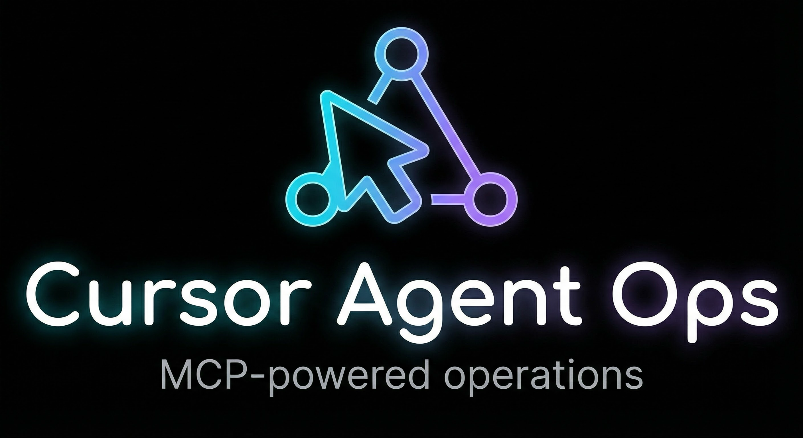

  

  
  
  
  
  

# Cursor Agent Operations Workspace

一个**以 MCP（Model Context Protocol）为核心**的 Cursor Agent 工作区：用自然语言驱动浏览器自动化、Blender 操作与“可回滚的成果导出”，并将经验沉淀为可复用的规则与操作手册。

---

## 这是什么？

- **项目定位**：纯 Agent 工作区（以工具调用与操作规范为主，不以编写业务代码为目标）。
- **核心能力**：
  - 浏览器自动化（Chrome DevTools MCP）
  - Blender 自动化与资产生成（Blender MCP）
  - 操作规范化：把“总结 / 导出成果 / 精简文档”等行为变成可重复执行的标准流程

---

## 快速开始

### 1) 常用一句话命令

面向人类的命令手册在：

- `docs/COMMANDS.md`

你可以直接对我说（示例）：

- `总结`
- `导出成果`
- `精简文档`

> 这些命令会触发固定流程（例如导出成果会遵循 `results/<name>-operations/` 结构，并带 `old/` 回滚与“确认”收尾机制）。

### 2) 规则（给 AI 的）

规则位于：

- `.cursor/rules/`

其中：

- **核心规范**：`alwaysApply: true`（例如 `coding-standards.mdc`、`project-conventions.mdc`）
- **操作手册**：`.cursor/rules/operations/` 且通常 `alwaysApply: false`（按需引用）

---

## 目录结构（约定）

### `docs/`（给人看的）

- 只放**面向人类阅读**的内容（例如命令手册、对外说明）。
- 不放“给 AI 的规则/提示”（那是 `.cursor/rules/` 的职责）。

### `.cursor/rules/`（给 AI 的规则）

- `.mdc` 为 Cursor Rules，可包含 frontmatter（`description / alwaysApply / globs`）。
- 操作最佳实践集中在 `.cursor/rules/operations/`。

### `results/`（导出成果）

- 导出成果必须进入：`results/<name>-operations/` 子文件夹。
- 子文件夹内至少包含：
  - `README.md`（文件说明/使用说明）
  - `SUMMARY.md`（操作总结/经验沉淀）

> 参考示例：`results/bilibili-operations/`、`results/blender-operations/`。

---

## “导出成果”是如何保证安全的？

导出成果遵循“可回滚 + 人工确认”的事务式流程：

1. 若目标目录已有成果，先创建 `old/` 并把旧成果移入（例如 `results/blender-operations/old/`）。
2. 开始导出并生成/更新文档。
3. **导出成功后不会立刻删除 `old/`**，而是等待你回复 `确认`。
4. 你若回复 `取消导出`，则把 `old/` 恢复回原位（回滚）。

---

## operations 如何沉淀成可复用资产？

每次 operation 完成后，建议将：

- **关键问题与解决方案**
- **可复用最短流程**
- **注意事项与边界条件**

写回 `.cursor/rules/operations/*.mdc`，把经验变成下一次更快、更稳的执行路径。

---

## 适用场景

- 需要稳定复现的浏览器操作（点赞/收藏/表单/抓取/验证）
- Blender 场景搭建、资产生成、材质修复、统一导出
- 将“人类的习惯指令”固化为可执行流程（命令化操作）

---

## 贡献与维护

- **新增 operation**：优先在 `.cursor/rules/operations/` 添加一份对应主题的操作手册（`alwaysApply: false`）。
- **新增命令**：在 `docs/COMMANDS.md` 补充“一句话命令”与对应动作。
- **保持整洁**：导出内容放进 `results/<name>-operations/`，不要散落在根目录。

